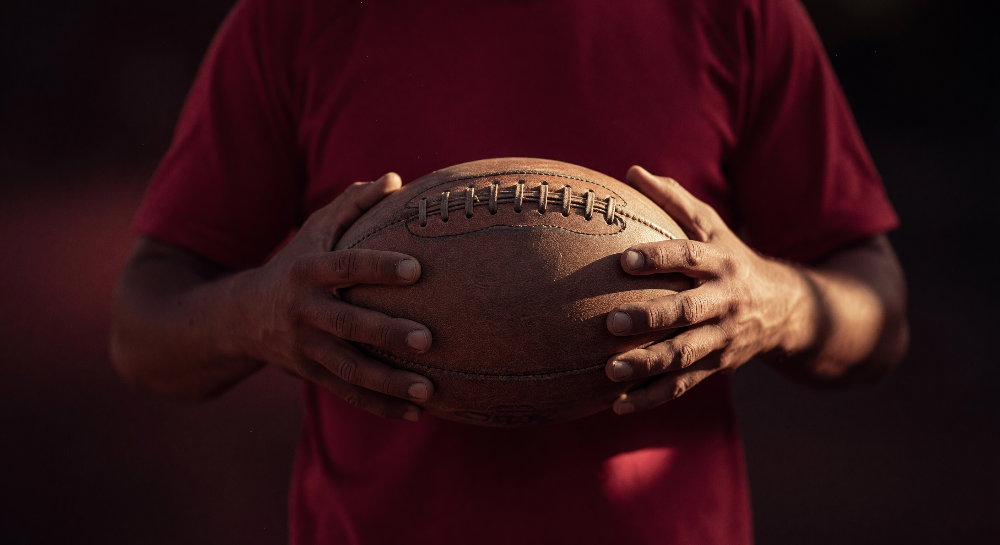
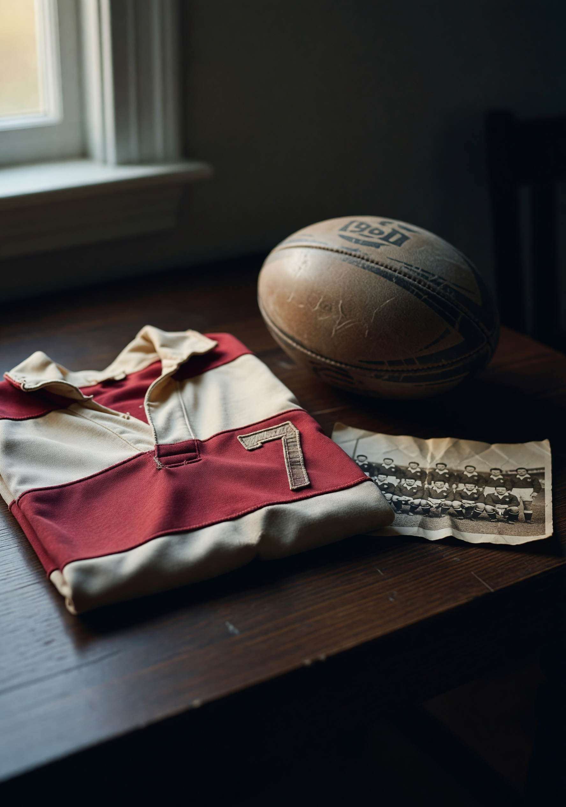
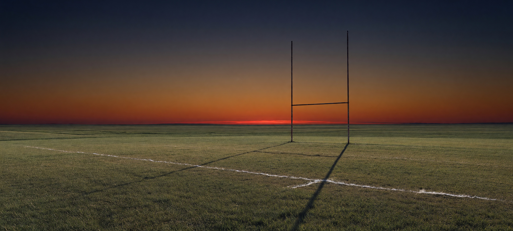
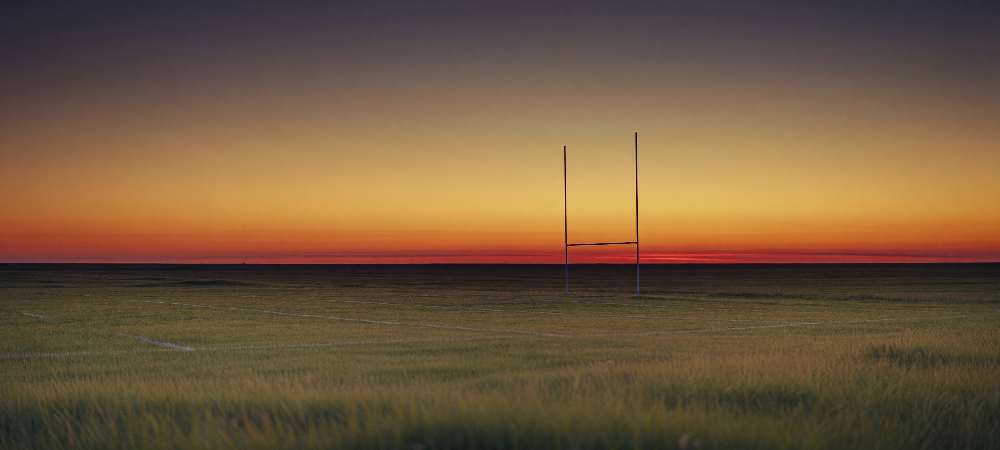
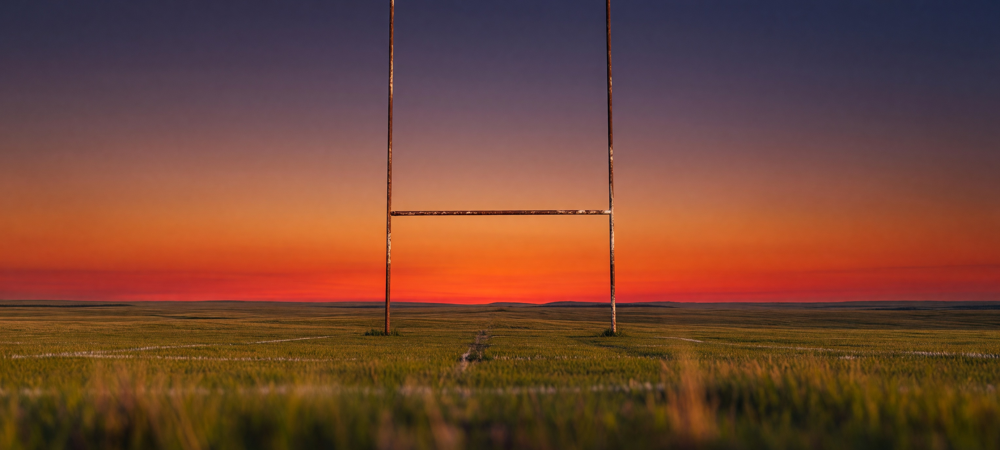
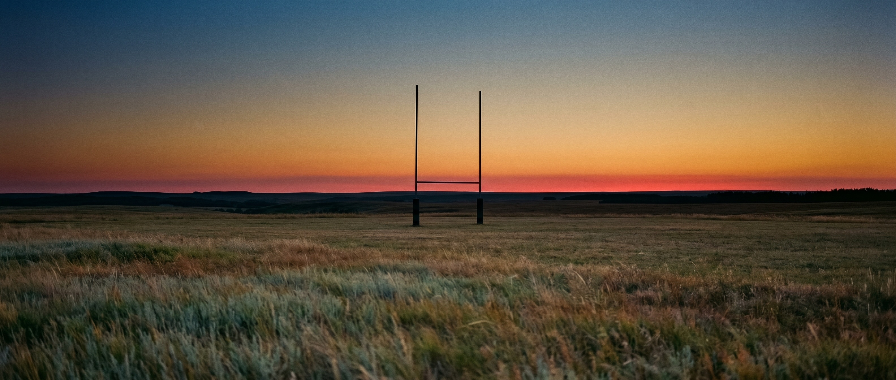

# Image Generation Log — Strathcona Druids RFC

---

### #1 — hero.jpg (Grok, passed first try)

- **Timestamp**: 2026-04-21 13:07
- **Tier**: 1 | **API**: Grok Imagine Standard 2K | **Cost**: $0.02
- **Slot**: `index.html` hero background
- **Prompt**: Close-up, hands gripping a weathered leather rugby ball against deep crimson jersey, warm raking sidelight, 85mm f/1.8, documentary heritage sports photography, wine-red/bronze palette, 35mm grain, no faces.
- **Claude**: 9/10 · 9/10 | **Grok QA**: 9/10 · 9/10 | **Issues**: none
- **Attempts**: 1/2 | **Status**: ✓ Used

---

### #2 — heritage-stilllife.jpg (Grok, second attempt after 4:5 aspect rejected)

- **Timestamp**: 2026-04-21 13:37
- **Tier**: 1 | **API**: Grok Imagine Standard 2K (3:4 portrait) | **Cost**: $0.02
- **Slot**: `index.html` Heritage section right column
- **Prompt**: Moody editorial still-life — cream-and-crimson rugby jersey folded on dark oak table, tarnished 1960s leather ball, creased black-and-white team photograph, window light from left, 50mm f/2.0, documentary heritage feel, wine-red/cream/bronze palette.
- **Claude**: 9/10 · 9/10 | **Grok QA**: 8/10 · 7/10 | **Issues**: faint "1901/1961" text on ball; small faces in team photo — both minor, image reads as intentional vintage flavour
- **Attempts**: 1/2 (prior attempt rejected with invalid `4:5` aspect ratio — Grok doesn't support it, not charged) | **Status**: ✓ Used
- **Notes**: Zack approved "nice and good to go" after review

---

### #3 — dusk-rejected-attempt1.jpg (Grok, REJECTED — chalk lines inaccurate)

- **Timestamp**: 2026-04-21 13:39
- **Tier**: 1 | **API**: Grok Imagine Standard 2K (20:9 ultra-wide) | **Cost**: $0.02
- **Slot**: Originally intended as index.html Park section divider
- **Claude**: 10/10 · 10/10 | **Grok QA**: 9/10 · 8.5/10 | **Issues**: multiple chalk lines instead of single specified
- **Attempts**: 1/2 (prior attempt rejected with invalid `21:9` aspect ratio — Grok doesn't support it, not charged) | **Status**: ✗ Rejected by Zack — "not accurate with the lines"
- **Notes**: Archived with `-rejected-attempt1` suffix per build rules

---

### #4 — banner-A-rejected.jpg (Grok retry #1, REJECTED)

- **Timestamp**: 2026-04-21 14:03
- **Tier**: 1 | **API**: Grok Imagine Standard 2K (20:9) | **Cost**: $0.02
- **Prompt refinement**: Sky-dominant composition, NO chalk lines, soft out-of-focus prairie foreground
- **Grok QA**: 7.5/10 tech · 5/10 prompt — "clearly visible white chalk/field markings in foreground (the exact reason prior version was rejected)"
- **Attempts**: counts as attempt 1 of the new 2-attempt cycle
- **Status**: ✗ Rejected — chalk lines persisted

---

### #5 — banner-B-rejected.jpg (Grok retry #2, REJECTED)

- **Timestamp**: 2026-04-21 14:04
- **Tier**: 1 | **API**: Grok Imagine Standard 2K (20:9) | **Cost**: $0.02
- **Prompt refinement**: Low-angle hero composition, weathered goalpost, minimal ground
- **Grok QA**: 8.5/10 tech · 4/10 prompt — "very prominent white field markings throughout foreground"
- **Attempts**: 2/2 for Grok tier — both attempts failed on the chalk-line rule, confirming need to escalate
- **Status**: ✗ Rejected — chalk lines even more prominent

---

### #6 — banner-C-selected.jpg / lynn-banner.jpg (Gemini Nano Banana 2, SELECTED)

- **Timestamp**: 2026-04-21 14:07
- **Tier**: 2 | **API**: Gemini Nano Banana 2 @ 2K (21:9 native ultra-wide) | **Cost**: $0.101
- **Slot**: `lynn-davies.html` tribute hero (full-bleed 90vh)
- **Prompt**: Cinematic ultra-wide Alberta prairie dusk, silhouetted rugby goalpost middle distance, indigo → amber → thin crimson horizon, empty prairie with natural grass texture (no pitch markings), 35mm docu landscape, muted sage + dusty amber palette, elegiac mood.
- **Claude**: 10/10 · 10/10 | **Grok QA**: 9/10 · 9/10 | **Issues**: none — Grok called it "the clear winner"
- **Attempts**: 1 at NB2 after 2 Grok attempts failed = 3/3 across tiers for this slot, but only 2 of those charged since the prior NB2 attempt at `21:9` initially failed because I used wrong quoting (no charge on validation error). Retried with correct quoting, succeeded first try.
- **Status**: ✓ Used — promoted from `banner-C-preview.jpg` → `lynn-banner.jpg`
- **Notes**: Zack chose C, confirming Grok QA's recommendation. NB2 handled the "no chalk lines" rule that Grok kept failing on.

---

## Hotlinked Real Photography (not generated, used from source Wix CDN)

These are real Druids / tournament / memorial photos pulled directly from the club's own Wix CDN and the Antediluvians memorial page. No generation cost.

### Real #R1 — Team huddle (Druids senior men · Windermere Studios · 2023)
- **Source**: `https://static.wixstatic.com/media/5c77aa_ca3205818e114fcbbec6923148030e53~mv2.jpg` (from druidsrfc.com/photography, credited to Windermere Studios)
- **Slot**: `lynn-davies.html` full-width photo module between "A Founding Member" and "He Cleaned the Field" sections
- **Why**: Shows Lynn's living legacy — the modern Druids in red on the ground he cleaned by hand. Sponsor patches visible (ESCOM, etc.) ground it as a real club photo.

### Real #R2 — Lynn Davies High School Tournament poster
- **Source**: `https://static.wixstatic.com/media/e73b12_35e5e32bdd95419b895808ead3cb730c~mv2.png` (from druidsrfc.com /post/lynn-davies-high-school-tournament)
- **Slot**: `lynn-davies.html` Tournament section — right-column inset beside body text
- **Why**: The event named after him, showing real high school players, with all tournament metadata (32nd annual, April 24–25 2026, McNally High School, Druids RFC at Lynn Davies Rugby Park)

### Real #R3 — Lynn Davies at the clubhouse (memorial photo)
- **Source**: `https://static.wixstatic.com/media/9ebeac_e8bafccaf75c443cb00ac16197470ebf~mv2.jpg` (from antediluvians.com memorial service post)
- **Slot**: `lynn-davies.html` Legacy section — photo module between first paragraph and grant mention
- **Why**: The man himself — full white beard (the "Santa Claus" nickname confirmed), wearing "Druids Rugby Sherwood Park · Since 1960" shirt, at the clubhouse. This is the emotional anchor of the tribute.
- **ACCURACY NOTE**: Identification of Lynn as the central figure is based on context: the photo was published on his 2019 memorial service announcement by Antediluvians RFC, and the man matches every descriptive detail from CBC's biography (Welsh, full white beard, club shirt, longtime Druids fixture). Flagged for Zack's confirmation in ACCURACY.md.

---

## Index.html + Tribute Page Image Inventory

**index.html**:
- Hero: `hero.jpg` (generated)
- Heritage section: `heritage-stilllife.jpg` (generated)
- Grant banner photo: hotlinked (real Wix CDN)
- Park section photo: hotlinked (real Wix CDN)
- Sponsor logos × 9: hotlinked (real Wix CDN)
- Crest: hotlinked (real Wix CDN)

**lynn-davies.html**:
- Hero: `lynn-banner.jpg` (= banner-C-selected.jpg, generated NB2)
- Team huddle (full-width module): hotlinked (real, Windermere Studios)
- Tournament poster (right column inset): hotlinked (real, Druids)
- Lynn at clubhouse (figure module): hotlinked (real, Antediluvians)
- Crest: hotlinked (real Wix CDN)

---

## Total Cost: $0.201
| Item | Cost |
|---|---|
| #1 Hero (Grok) | $0.02 |
| #2 Heritage still-life (Grok, 3:4) | $0.02 |
| #3 Dusk banner rejected (Grok, 20:9) | $0.02 |
| #4 Banner A rejected (Grok retry, 20:9) | $0.02 |
| #5 Banner B rejected (Grok retry, 20:9) | $0.02 |
| #6 Banner C selected (Gemini NB2, 21:9) | $0.101 |
| **Total** | **$0.201** |

Well under the $0.75 per-build cap. QA calls used: 4 (hero, heritage, dusk, bundled 3-banner review) — under 15 cap.

---

## Image Accuracy Compliance

Per CLAUDE.md rules:
- Hero image = generic rugby ball/jersey filler (not actual club kit) ✓
- Heritage still-life = generic vintage jersey + ball + generic team photo (not actual Druids) ✓
- Dusk banner = generic Alberta prairie landscape (not actually Lynn Davies Rugby Park) ✓
- Real photos are the club's own published assets, used with credit where known
- Lynn's memorial photo is from a public memorial page, captioned appropriately
